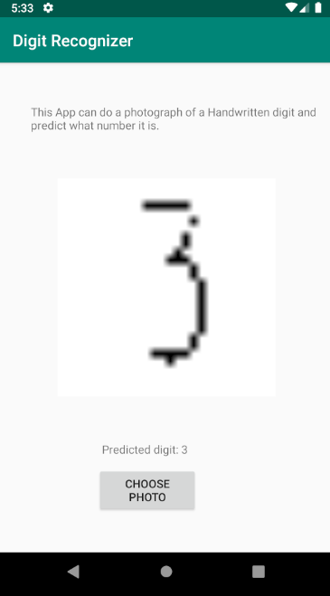

# AndroidAppDigitRecognizer
> An Android app which recognized handwritten digits with the help of a Neural Network.

[![Codacy Badge][codacy-badge]][codacy-url]

## Release History
*   1.0.0
    *   Release of first version

## Usage
1. Download the `.apk` under Releases. 
2. Install it on you Smartphone
3. Open it and use it :)

## Meta

<!--Your Name – [@YourTwitter](https://twitter.com/dbader_org) – YourEmail@example.com-->

Distributed under the MIT license. See ``LICENSE`` for more information.

[LICENSE Digit-Recognition](https://github.com/LuposX/BostonHousingPrediction/blob/master/LICENSE)

## Contributing

1.  Fork it (<https://github.com/LuposX/AndroidAppDigitRecognizer/fork>)
2.  Create your feature branch (`git checkout -b feature/fooBar`)
3.  Commit your changes (`git commit -am 'Add some fooBar'`)
4.  Push to the branch (`git push origin feature/fooBar`)
5.  Create a new Pull Request

[license-url]: https://github.com/LuposX/AndroidAppDigitRecognizer/blob/master/LICENSE
[codacy-badge]: https://api.codacy.com/project/badge/Grade/83a9aefbc07c469cb115e69ba3a23208
[codacy-url]:https://www.codacy.com/manual/LuposX/AndroidAppDigitRecognizer?utm_source=github.com&amp;utm_medium=referral&amp;utm_content=LuposX/AndroidAppDigitRecognizer&amp;utm_campaign=Badge_Grade
